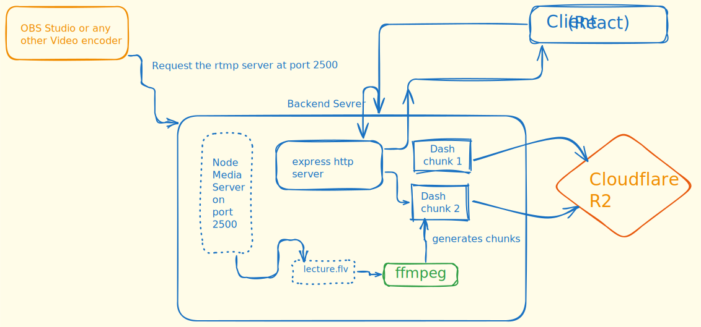

# Introduction

Hello Everyone! This repository consists of the backend code for my application [Ed-Era](https://ed-era.pages.dev).You can login with `username: Prateek` and `password: hello`

This application provides live streaming of video lectures and recorded ones of any particular subject.

This is possible through `RTMP` protcol

# Architecture

From above it is clear that the majority of the live streaming operations are handled
`ffmpeg` and `Node media Server`.

The stream is transported through `Dash` and after that it is stored in the form of chunks in the cloud storage.

In the Ed-era application which is a use-case of it. There is also a `No-SQL` database `MongoDb` which acts as meta data store for storing chunks location and students information

Any suggestions and contributions are welcomed.

# Refrences

[NodeMediaServer](https://www.npmjs.com/package/node-media-server)

[OBS](https://obsproject.com/)

[ffmpeg](https://ffmpeg.org/)
